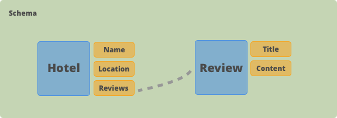
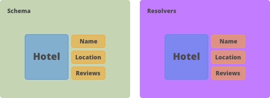
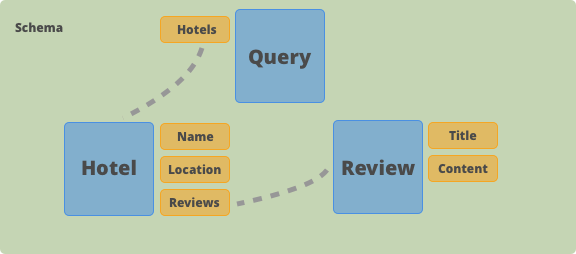

# GraphQL Introduction

Before we take a deep dive into every aspect of GraphQL let's get a high-level overview of
all parts and how they work together.

The core concept of GraphQL is to allow users of an API to formulate a _query_ that describes
their data needs.

This _query_ will be sent to a server that understands it and is able to
gather together the requested data.

To allow that we need to shift our view on how an API works.

If you're familiar with REST you're used to APIs that consists of multiple endpoints with
each endpoint returning a fixed data structure. It was the job of the API developer to ultimately decide which data is returned from an endpoint.

In GraphQL we don't want the API developer to decide on which data gets sent to the users of an API.
We want to give that control to the users. That sound pretty legit, doesn't it?

For a user to be able to _query_ for specific data he first needs to know what data is available.

## Schema

That's where the most import part of a GraphQL API comes in: **The schema**.
It's a description of all the data that's available and how this data looks like.



The blue boxes represent _types_.
A _type_ describes the shape of a certain piece of data.
A hotel has a couple of attributes like a name and a location. Those attributes are called _fields_ and are displayed in orange boxes.
The schema can also describe the relationship between our data. Note that a hotel has _reviews_.

You'll learn more about the schema in the next chapter.

## Resolvers

The schema describes what data is available.
Now we need a way to retrieve the actual data. That's what _resolvers_ are for.

A _resolver_ is a function that is defined for each _field_ on a type.
Its only purpose is to get exactly this single piece of data.

The _name_ resolver is in charge of getting the hotel's name and so on.



We'll end up with a function for each field.
This way our GraphQL API is able to respond to any request that comes its way because it knows how to get any piece of data.

We'll learn how to actually implement a resolver in the chapter: **Resolvers**.

## Query

This is where it gets interesting.
Queries are the way for our users to express their data needs.

They know what's available to them so all they have to do is follow the entry point
and add all the fields they need in their query.

The entry point is just another _type_ we need to add to our _schema_.
It's no different than any other _type_ we added before and follows the same rules.
It defines _fields_ and requires a resolver function per field.
The only thing special about this type is that it has to be named _Query_ as it documents all possible _queries_ to our API.



Now that our query type has a _field_ hotels on it our users can move along the
nodes of our graph and pick the fields they are interested in for each node.

We can decide to stop at any node or keep traversing the graph's relationships.
It's completely up to us.

So we start at the entry point `query` and choose a route along the graph.
We go with `hotels`. At the **Hotel** node, we decide which information about the hotels is of interested to us.
We pick the _name_ and the _reviews_. Now we traverse to the **Review** node where we grab the _title_ and the _content_.

That's our query in plain English. In GraphQL it looks like this:

```javascript
query {
    hotels {
        name
        reviews {
            title
            content
        }
    }
}
```

It's actually pretty easy to reason about, isn't it?
We simply follow our graph. And since we defined our schema our IDEs can actually help us with that.
They'll provide us with autocomplete suggestions. Neat!
We'll learn how to set that up in another chapter.

## Response

So what does our server do?
It's actually really simple. It takes the query and calls the corresponding _resolvers_ that we have defined earlier.

You've probably noticed the recursive nature of our query.

Our server will first call the `Query.hotels` resolver which is in charge of getting all the hotels.
Let's assume it makes a database request and returns a list of hotels that look like this:

```json
{
  "hotels": [
    {
      "name": "My favorite hotel",
      "location": "1 Main Street, CA",
      "reviews": [
        {
          "title": "Awesome!",
          "content": "Love this hotel!",
          "date": "2019-03-26"
        }
      ]
    }
  ]
}
```

Next, it will call the `Hotel.name` and `Hotel.reviews` resolver for each of those hotels.

A resolver will always receive the returned value of its parent as an argument.
This means that our `Hotel.name` resolver has access to the hotel object from the database.

In most cases, all a resolver has to do is to return its corresponding slice of that data.
So a resolver for `Hotel.name` will look something like this:

```javascript
const hotelNameResolver = hotel => hotel.name;
```

Our server is smart enough to know which resolvers can be called concurrently because they don't depend on each other's
data (like `Hotel.name` and `Hotel.review`) and which resolvers need to be called in sequence.
After all of the data is resolved the response will reflect the shape of our query.

```json
{
   "data" : {
       "hotels" : [
           "name" : "My favorite hotel",
           "reviews" : [
               {
                  "title" : "Awesome!",
                  "content": "Love this hotel!"
               }
           ]
       ]
   }
}
```
