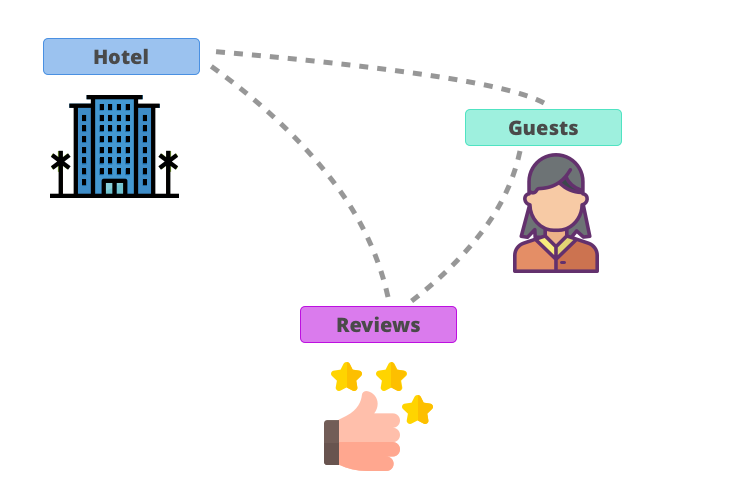

# The schema

The schema is the heart of GraphQL.
It represents all the data that is available in our API.

We specify what our data looks like, what fields are available
and what type those fields are.

It's a contract between the API and its users.



Let's assume our data looks like this:
We have hotels. Those hotels have guests that are currently staying at the hotel.
After their visiting, those guests can leave a review for a hotel.

Can you see the graph-based nature of it?
How convenient that we're learning the perfect technology to handle this.

## Defining the schema

There are multiple ways to define a schema.
Remember that GraphQL is a specification? It's doesn't care how you create your schema - as long as it's there in the end.

One way to do it is to use the **Schema Definition Language**.

Let's take our hotel. A hotel has a couple of attributes available to it.
It has a _name_, a _location_, a _rating_ and some information like whether it has a _pool_ or not.

Since we know the shape of our hotels,
we can add it to the schema by creating a hotel _type_.

```javascript
type Hotel {
    name: String
    location: String
    rating: Float
    hasPool: Boolean
}
```

A type is a description of what data looks like.
This is useful for our users because they get a grasp of what they can ask our API about hotels.

There's a couple of things going on, so let's start at the top.

`type Hotel {`

> tells our schema that we're now starting to describe a new _type_ which we will call hotel.

`name: String`

> tells our schema that our new type hotel has a field named _name_ on it. Which is of type String

`location: String`

> tells our schema that our new type hotel has a field named _location_ on it. Which is of type String

`rating: Float`

> tells our schema that our new type hotel has a field named _rating_ on it. Which is of type Float

`hasPool: Boolean`

> tells our schema that our new type hotel has a field named _hasPool_ on it. Which is of type Boolean

`}`

> tells our schema that we stop describing our type _hotel_ now.

## Scalar Types

You may have noticed that GraphQL has a set of default types which include:

- `String`: A sequence of UTF-8 characters.
- `Int`: A signed 32-bit integer number ranging from −2,147,483,648 to 2,147,483,647
- `Float`: A signed floating-point value
- `Boolean`: True or false

Those types are called _scalar types_.

They're special because each data shape can be represented as a combination of those types.
After all, our hotel is just a set of strings, floats, and booleans.

Our hotel type is called an _object type_.

If you think about your schema as a tree (which is actually a subset of a graph) you can image
_object types_ to be the branches and _scalar types_ to be the leaves.

A branch can have smaller branches attached to it, but in the end, it all resolves to leaves.

In a later chapter, we're going to learn how to create a custom _scalar type_ to create custom validation for our schema.

## Lists and Relationships

We can add the reviews and guests to our schema as well.

```javascript
type Guest {
    firstName: String
    lastName: String
    age: Int!
}

type Review {
    title : String
    content: String
}
```

We've defined all types that our API has to offer.
But we're missing the most important part of our graph: The relations.

A hotel has guests and reviews. And a review has a guest that has written that review.
Fields in our types don't have to be _scalar types_. They can actually reference other _object types_ as well.

```javascript
type Review {
    ...
    author : Guest
}
```

We've added a new field _author_ to our Review which tells our users that they can access the information
about the Guest that has written that review here.

```javascript
type Hotel {
    ...
    guests: [Guest]
    reviews: [Review]
}
```

The brackets around indicate that we are dealing with a list.
A hotel can have multiple guests and multiple reviews.

## Non-null values

Modeling our schema like that is awesome because we're communicating exactly what to expect from our API.

We've defined all our data and the relationship between them.
Our users know what data is available and what it looks like.

But do they know if the data available at all?

What if a hotel doesn't have any reviews?
The user needs to know if missing values can occur so he can prepare his application for it.

Luckily, GraphQL offers a way to hint our users if a value is guaranteed to be there: `!`
If we add an `!` to our type we make a promise to deliver a value.

Let's adjust our hotel type:

```javascript
type Hotel {
    name: String!
    location: String!
    rating: Float
    hasPool: Boolean!
    guests: [Guest!]!
    reviews: [Review]!
}
```

All of our hotels have a name and location.
So it's safe to make a promise that we will always be able to deliver them.

If nobody rated our hotel so far, we don't have an overall rating available.
That's why we can't make a promise here.

The user can still ask for a rating, but if we don't have one, we are allowed to return `null`.
By adding those availability hints our users are aware of those situation and can write their apps to handle missing values accordingly.

Have you noticed the lists? They're quite interesting because they can actually have two `!`s.
One after the type and one after the bracket.
The `!` after the type promises that if we return a list then it will have at least one value in it.
The `!` after the bracket promises that we return a list at all. It could be an empty one though.

- `[Type!]!` : There will always be a list with at least one item in it
- `[Type]!` : There will always be a list - but it could be empty.
- `[Type!]` : If there are no items the list will be null, but if there is a list there's at least one item in it.
- `[Type]` : There might or might not be a list. It might or might not have values. (You're probably only ever going to use this if you're an indecisive type of person. Don't be that if you're designing an API 😉)

## Documenting

While GraphQL's type-system helps to document the shape of the data, it's always a good practice to add additional information
about our API.

We can use a `# Comment` above a type or a field to add a comment to it.
This way we can provide additional insight into our API that might help our users understand certain aspects of it.

```javascript
type Hotel {
    name: String!
    # Location is a combination of Address + Country
    location: String!
    # Average of all customer ratings
    rating: Int
    hasPool: Boolean!
    guests: [Guest!]!
    reviews: [Review]!
}

type Guest {
    firstName: String!
    lastName: String!
    age: Int!
}

# A review is always written by a guest that has stayed in that hotel
type Review {
    title: String!
    content: String!
    author: Guest!
}
```

## Conclusion

We've learned how to describe our data by using the Schema Definition Language.
The schema is the most important part of GraphQL because it serves as a contract between users and our API.
GraphQL's type system helps to document the API by defining the type of data.
